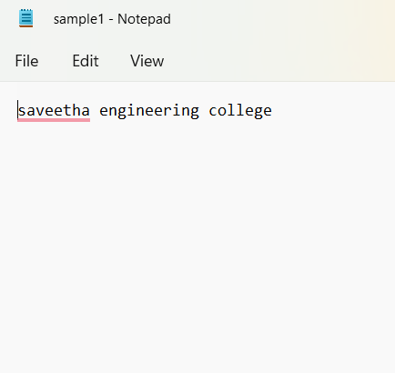
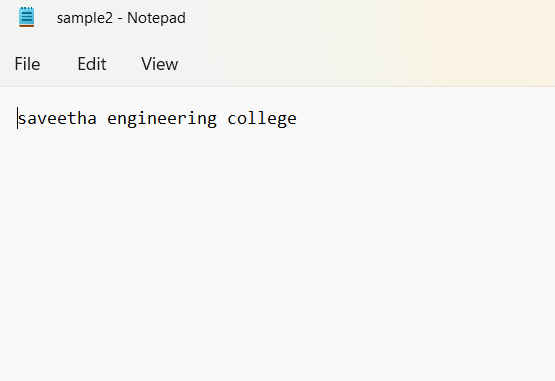

# copy-file
## AIM:
To write a python program for copying the contents from one file to another file.
## EQUIPEMENT'S REQUIRED: 
PC
Anaconda - Python 3.7
## ALGORITHM: 
### Step 1:
First we need to open the required file form which we need to copy the text.

### Step 2: 
Using keyword "with" to open the requied file.
### Step 3: 
Again using the with keyword to open the empty file.
### Step 4:  
The empty file is open by using 'W' which is used to write only.
### Step 5: 
The four function is used to take each line from the main file.
### Step 6: 
The four function is used to take each line from the main file.

## PROGRAM:
```
#Developed By:-PRAVEEN S
#Register number:-22009017
with open("sample1.txt", "r") as firstfile:
    with open("sample2.txt", "a") as secondfile:
        for line in firstfile:
            secondfile.write(line)
```
### OUTPUT:


## RESULT:
Thus the program is written to copy the contents from one file to another file.
